# About Alldata

​	AllData Big Data products are definable data middleware, providing full-link digital solutions with a data platform as the base, a data middleware as the bridge, a machine learning platform as the mid-layer framework, and a big model application as the upstream product.

## vulnerabilities

I found three vulnerabilities in the Alldata project.The vulnerability verification used uses the official demonstration environment, with the environment address and test username and password as follows:

URL:http://122.51.43.143/dashboard

user/pwd:test/123456

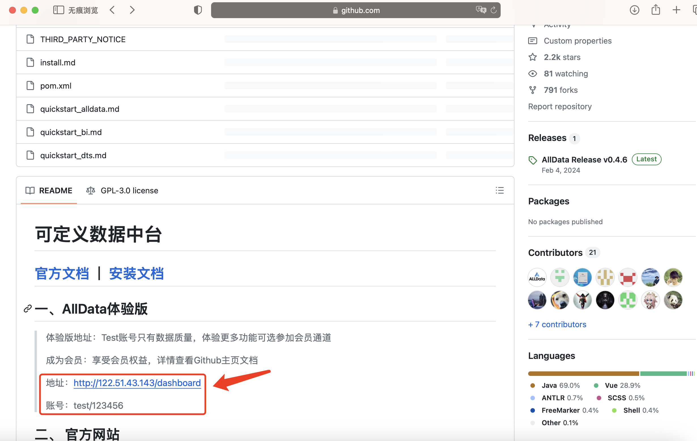

### 01-Deserialization vulnerability

The system uses a vulnerable FASTJSON component to serialize request data, allowing attackers to construct malicious request data and execute system commands

URL：http://122.51.43.143/api/system/auth/login

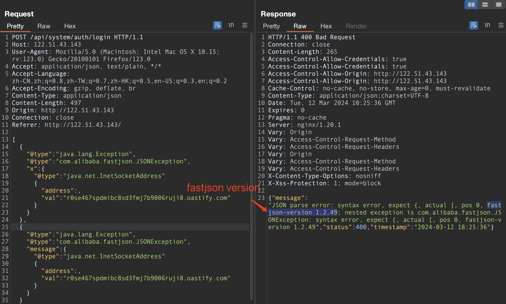

dnslog

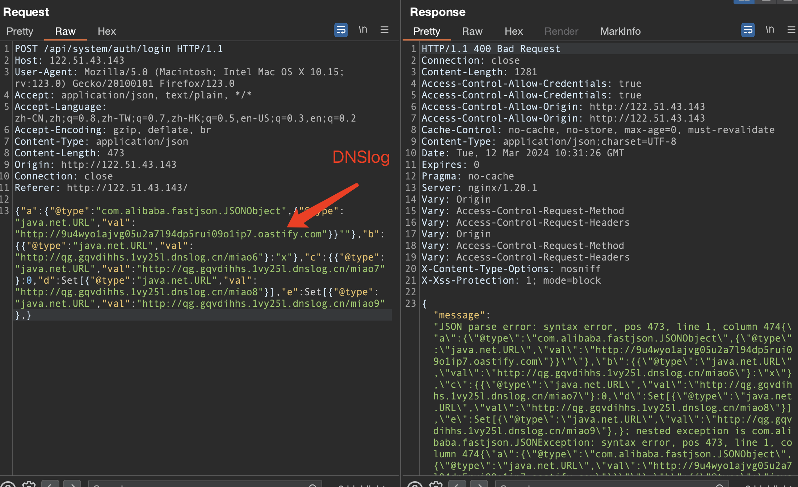

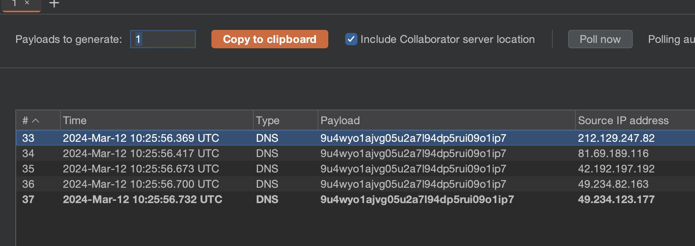

Filepath：/alldata-alldata-0.4.6/studio/common/common-service-api/pom.xml 

Line number：42

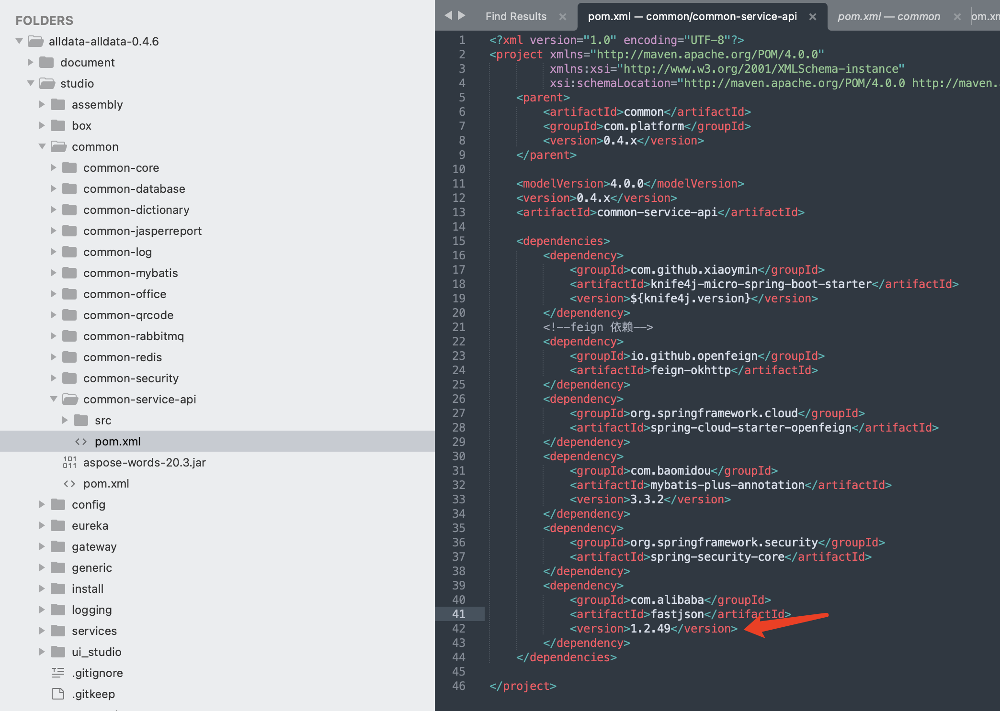

### 02-SQL injection

SQL injection exists for the tablename parameter

URL：http://122.51.43.143/api/data/masterdata/datas/1?tableName=masterdata_model_column

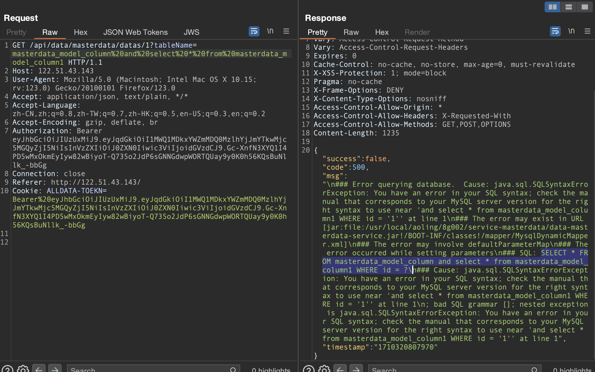

Filepath：/alldata-alldata-0.4.6/studio/services/data-masterdata-service-parent/data-masterdata-service/src/main/java/cn/datax/service/data/masterdata/controller/ModelDataController.java

Line number：22-25

Description：ModelDataController class receives tablename parameter and pass the parameters to the modelDataService.getModelDataById() class

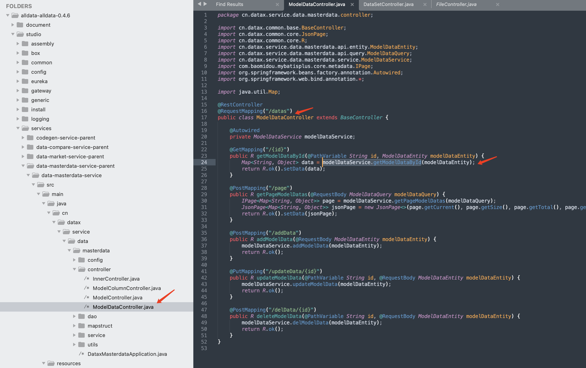

Filepath：/alldata-alldata-0.4.6/studio/services/data-masterdata-service-parent/data-masterdata-service/src/main/java/cn/datax/service/data/masterdata/service/impl/ModelDataServiceImpl.java

Line number：99-110

Description：dynamicDao.getData() class directly calls SQL query

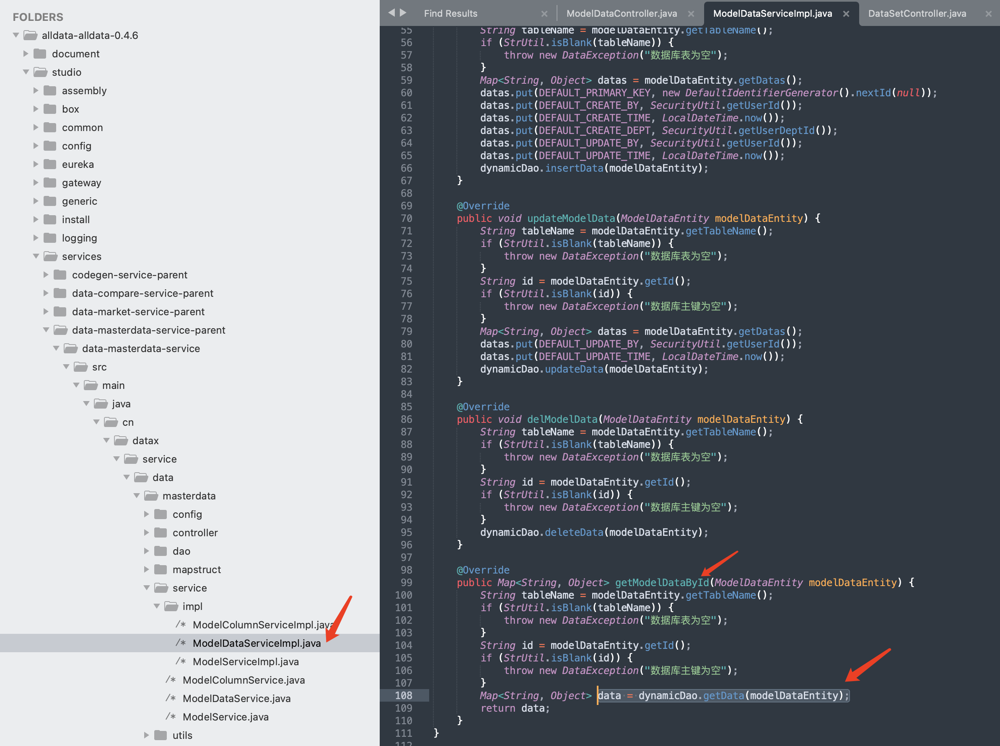

Filepath：/alldata-alldata-0.4.6/studio/services/data-masterdata-service-parent/data-masterdata-service/src/main/resources/mapper/MysqlDynamicMapper.xml

Line number：61-63

Description：Splicing the tablename parameter into an SQL statement for querying

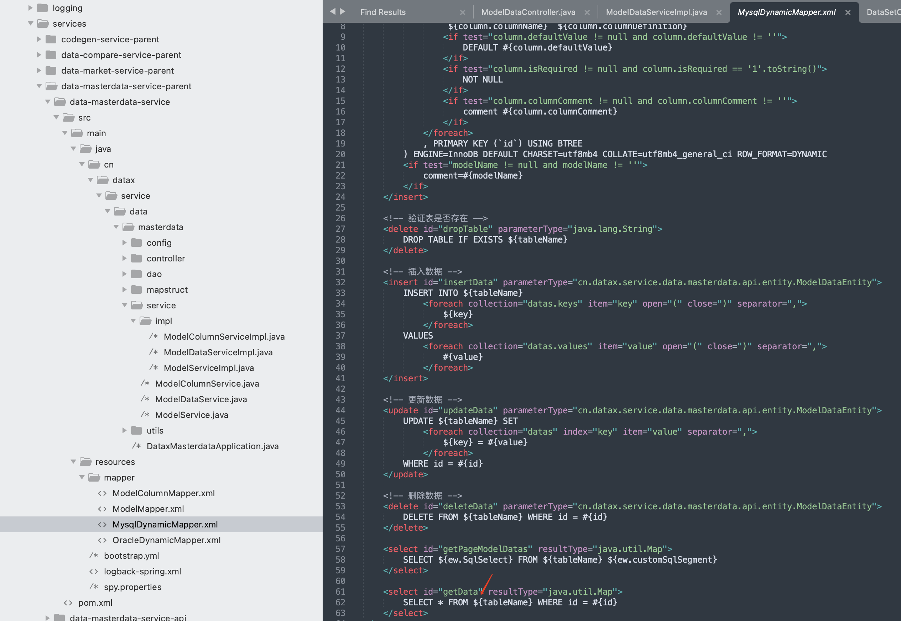

### 03-Directory traversal

The system image upload interface did not detect the file name of the uploaded file. It can be accessed through ../ Save files to any directory

URL:http://122.51.43.143/api/system/api/localStorage/pictures

Filename:test.jpg

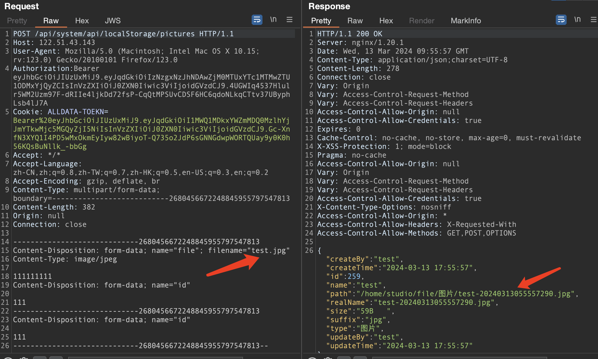

Filename:../../../../test.jpg

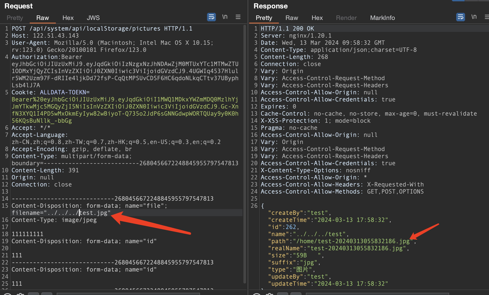

Filepath：/alldata-alldata-0.4.6/studio/box/src/main/java/com/platform/rest/LocalStorageController.java

Line number：57-65

Description：The LocalStorageController receives the uploaded image file and hands it over to the create method of the localStorageService class for processing

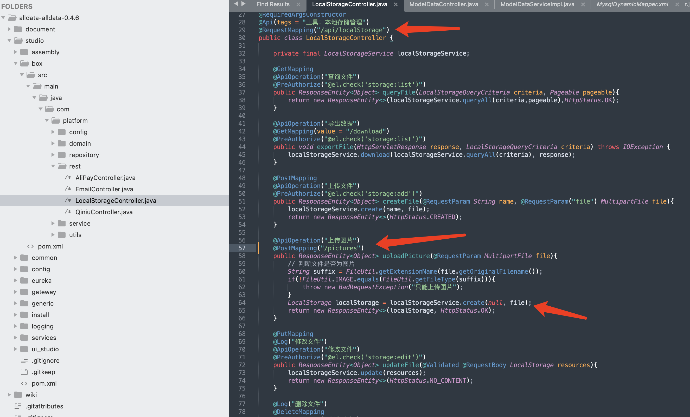

Filepath：/alldata-alldata-0.4.6/studio/box/src/main/java/com/platform/service/impl/LocalStorageServiceImpl.java

Line number：64

Description：Image files are processed using the FileUtil. upload method

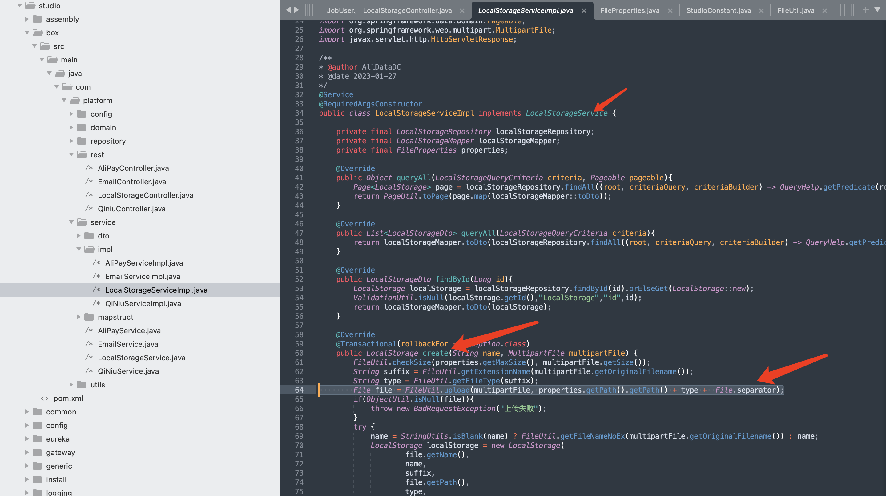

Filepath：/alldata-alldata-0.4.6/studio/generic/src/main/java/com/platform/utils/FileUtil.java

Line number：171-186

Description：The original file name is concatenated into the directory where the file is saved, which can be accessed through ../ Save files to any location

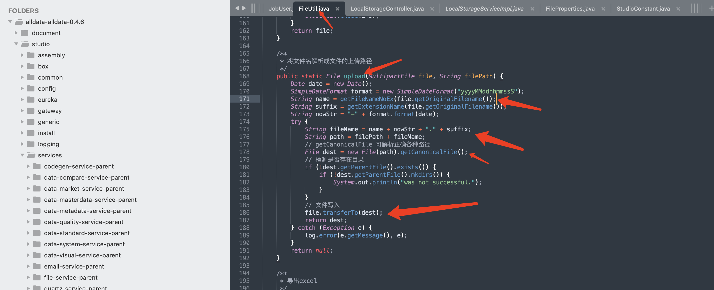

### 04-Command execution vulnerability

​    When the system calls the kill command to shut down a process, due to the lack of detection of the processId parameter, attackers can concatenate any system command into the processId parameter. When the system executes the kill command, the concatenated system command is executed.

Filepath：/alldata-alldata-0.4.6/studio/services/service-data-dts-parent/service-data-dts/src/main/java/com/platform/admin/controller/JobLogController.java

Line number：171-186

Description：The JobLogController class receives the JobLog class object and passes the string type processId property of the JobLog class object to the KillJob. trigger method for processing.

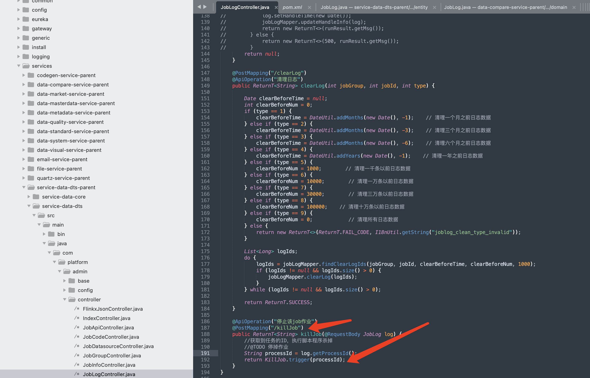

Filepath：/alldata-alldata-0.4.6/studio/services/service-data-dts-parent/service-data-dts/src/main/java/com/platform/admin/core/kill/KillJob.java

Line number：34

Description：The processId parameter is concatenated into the system command and executed directly.

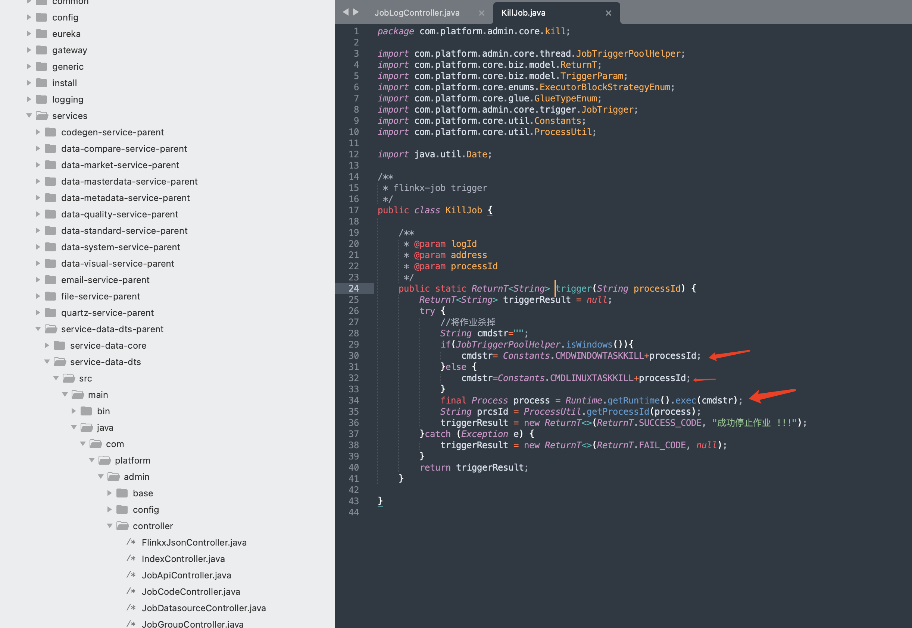
